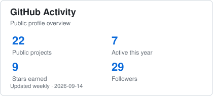
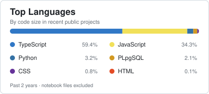

  <h1>Hi, I'm Farhan 👋</h1>
  <h3>Data &amp; Software Engineer</h3>
  
Building analytics, automation, machine learning, and privacy-first software.

  

    
    
  

## About Me

I'm a software and data enthusiast from Indonesia with a background in Informatics Engineering. I enjoy turning data and ideas into practical products—from analytics dashboards and automation workflows to machine learning systems and web applications.

I'm currently focused on:

- Data analytics & business intelligence
- Workflow and process automation
- Machine learning & predictive analytics
- Full-stack web development
- Cloud-based applications

I care about building solutions that are useful, maintainable, and easy for people to understand.

## 🚀 What I'm Working On

### 🛡️ [WatermarkMe](https://github.com/FrhnSpwli/watermark-me)

A privacy-first document watermarking application built for secure document processing.

`React` · `TypeScript` · `Supabase` · `PDF Processing` · `PWA`

- Image and PDF watermarking with local-first processing
- Multi-file document management and a mixed document composer
- Secure private storage backed by Row Level Security

### 🎬 [My Review Notes](https://github.com/FrhnSpwli/my-review-notes)

A personal media tracker for discovering, organizing, rating, and reviewing books, movies, and TV series in one place.

`React` · `Vite` · `Firebase` · `REST API`

- Book and movie discovery through external APIs
- Personal ratings and review notes
- Reading and watching status tracking
- Organized media collections

### 💰 Uangara

A personal finance app built around one simple idea: knowing where your money actually lives across multiple wallets.

`React` · `TypeScript` · `Supabase` · `PWA`

- Multiple bank account and e-wallet management
- Income and expense tracking
- Transfers between wallets
- Real-world wallet balance tracking
- Mobile-friendly installable web experience

## 🧰 Tech Stack

**Data & Analytics**

**Software Development**

**Backend & Cloud**

**Tools**

## 📈 GitHub Activity

  <picture>
    <source media="(prefers-color-scheme: dark)" srcset="./assets/github-stats-dark.svg">
    <source media="(prefers-color-scheme: light)" srcset="./assets/github-stats.svg">
    
  </picture>
  <picture>
    <source media="(prefers-color-scheme: dark)" srcset="./assets/top-langs-dark.svg">
    <source media="(prefers-color-scheme: light)" srcset="./assets/top-langs.svg">
    
  </picture>

## Contribution Snake

<picture>
  <source media="(prefers-color-scheme: dark)" srcset="https://raw.githubusercontent.com/FrhnSpwli/FrhnSpwli/output/github-snake-dark.svg">
  <source media="(prefers-color-scheme: light)" srcset="https://raw.githubusercontent.com/FrhnSpwli/FrhnSpwli/output/github-snake.svg">
  
</picture>

## 🤝 Let's Connect

I'm always interested in talking about data, software engineering, machine learning, cloud, and building useful products.

[LinkedIn](https://linkedin.com/in/andifarhansappewali) · [GitHub](https://github.com/FrhnSpwli)
